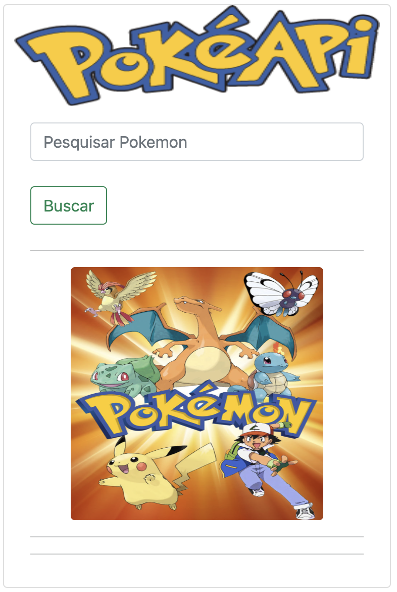
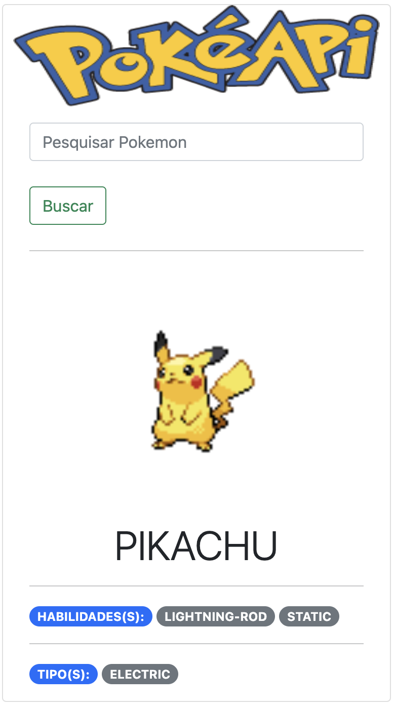

## Instalar o projeto e rodar sem Docker:

Crie o virtual environment com: `python -m venv venv`.

Acessar o virtual environment no macOS com: `. venv/bin/activate`.

Instalar os requirements com: `pip install -r requirements.txt`.

Rode o Flask com `flask run`.

Por último acesse `http://127.0.0.1:5000/`.

## Rodando o projeto com Docker:

Na raiz do projeto rode: `docker build --force-rm  -t  PokeAPI/latest . --no-cache`.

Depois rode: `docker run -p 5010:5000 -d --name PokeAPI PokeAPI/latest:latest`.

Por último acesse `http://localhost:5010/`.

## Rodando o projeto sem o Docker:

Na raiz do projeto rode: `docker build --force-rm  -t  PokeAPI/latest . --no-cache`.

Depois rode: `docker run -p 5010:5000 -d --name PokeAPI PokeAPI/latest:latest`.

Por último acesse `http://localhost:5010/`.

## Exemplos

##